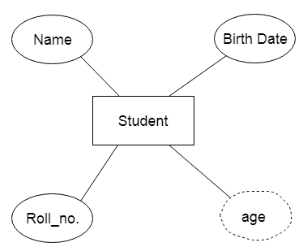

### DBMS?
- A ```database``` is an organized collection of data, so that it can be easily accessed and managed.

### DBMS Architecture
- 1-Tier Architecture
    - In this architecture, the database is directly available to the user. It means the user can directly sit on the DBMS and uses it.
    - Any changes done here will directly be done on the database itself. It doesn't provide a handy tool for end users.
    - The 1-Tier architecture is used for development of the local application, where programmers can directly communicate with the database for the quick response
- 2-Tier Architecture
    - The 2-Tier architecture is same as basic client-server. In the two-tier architecture, applications on the client end can directly communicate with the database at the server side. For this interaction, API's like: ODBC, JDBC are used.
    - The user interfaces and application programs are run on the client-side.
    - The server side is responsible to provide the functionalities like: query processing and transaction management.
    - To communicate with the DBMS, client-side application establishes a connection with the server side.
- 3-Tier Architecture
    - The 3-Tier architecture contains another layer between the client and server. In this architecture, client can't directly communicate with the server.
    - The application on the client-end interacts with an application server which further communicates with the database system.
    - End user has no idea about the existence of the database beyond the application server. The database also has no idea about any other user beyond the application.
    - The 3-Tier architecture is used in case of large web application.

### Data Independence
- Data independence refers characteristic of being able to modify the schema at one level of the database system without altering the schema at the next higher level.

#### Logical Data Independence
- Logical data independence refers characteristic of being able to change the conceptual schema without having to change the external schema.
- Logical data independence is used to separate the external level from the conceptual view.
If we do any changes in the conceptual view of the data, then the user view of the data would not be affected.
Logical data independence occurs at the user interface level.
#### Physical Data Independence
- Physical data independence can be defined as the capacity to change the internal schema without having to change the conceptual schema.
- If we do any changes in the storage size of the database system server, then the Conceptual structure of the database will not be affected.
- Physical data independence is used to separate conceptual levels from the internal levels.
- Physical data independence occurs at the logical interface level.


### Integrity Constraints
- Integrity constraints are a set of rules. It is used to maintain the quality of information.
- Integrity constraints ensure that the data insertion, updating, and other processes have to be performed in such a way that data integrity is not affected.
- Thus, integrity constraint is used to guard against accidental damage to the database.
- 
    ####  Domain constraints
    - Domain constraints can be defined as the definition of a valid set of values for an attribute.
    - The data type of domain includes string, character, integer, time, date, currency, etc. The value of the attribute must be available in the corresponding domain.
  
        

    #### Entity integrity constraints
    - The entity integrity constraint states that primary key value can't be null.
    - This is because the primary key value is used to identify individual rows in relation and if the primary key has a null value, then we can't identify those rows.
    - A table can contain a null value other than the primary key field.

        

    #### Referential Integrity Constraints
    - A referential integrity constraint is specified between two tables.
    - In the Referential integrity constraints, if a foreign key in Table 1 refers to the Primary Key of Table 2, then every value of the Foreign Key in Table 1 must be null or be available in Table 2.

        

    #### Key constraints
    - Keys are the entity set that is used to identify an entity within its entity set uniquely.
    - An entity set can have multiple keys, but out of which one key will be the primary key. A primary key can contain a unique and null value in the relational table.

        


### Data Models
- Data Model is the modeling of the data description, data semantics, and consistency constraints of the data. It provides the conceptual tools for describing the design of a database at each level of data abstraction

    #### Relational Data Model:
     - This type of model designs the data in the form of rows and columns within a table. Thus, a relational model uses tables for representing data and in-between relationships. Tables are also called relations. This model was initially described by Edgar F. Codd, in 1969. The relational data model is the widely used model which is primarily used by commercial data processing applications.

    #### Entity-Relationship Data Model:
    -  An ER model is the logical representation of data as objects and relationships among them. These objects are known as entities, and relationship is an association among these entities. This model was designed by Peter Chen and published in 1976 papers. It was widely used in database designing. A set of attributes describe the entities. For example, student_name, student_id describes the 'student' entity. A set of the same type of entities is known as an 'Entity set', and the set of the same type of relationships is known as 'relationship set'.

    #### Object-based Data Model:
    -  An extension of the ER model with notions of functions, encapsulation, and object identity, as well. This model supports a rich type system that includes structured and collection types. Thus, in 1980s, various database systems following the object-oriented approach were developed. Here, the objects are nothing but the data carrying its properties.

    #### Semistructured Data Model: 
    - This type of data model is different from the other three data models (explained above). The semistructured data model allows the data specifications at places where the individual data items of the same type may have different attributes sets. The Extensible Markup Language, also known as XML, is widely used for representing the semistructured data. Although XML was initially designed for including the markup information to the text document, it gains importance because of its application in the exchange of data.

### ER(entity relationship) Model
- ER model stands for an Entity-Relationship model. It is a high-level data model. This model is used to define the data elements and relationship for a specified system.
- It develops a conceptual design for the database. It also develops a very simple and easy to design view of data.
- In ER modeling, the database structure is portrayed as a diagram called an entity-relationship diagram.
- For example, Suppose we design a school database. In this database, the student will be an entity with attributes like address, name, id, age, etc. The address can be another entity with attributes like city, street name, pin code, etc and there will be a relationship between them.

    - 

    #### Component of ER Diagram    
    - 

    - Entity
      - An entity may be any object, class, person or place. In the ER diagram, an entity can be represented as rectangles.
      - Consider an organization as an example- manager, product, employee, department etc. can be taken as an entity.

        

      - ```Weak Entity```

         - An entity that depends on another entity called a weak entity. The weak entity doesn't contain any key attribute of its own. The weak entity is represented by a double rectangle.

    - Attribute
        - The attribute is used to describe the property of an entity. Eclipse is used to represent an attribute.
        - For example, id, age, contact number, name, etc. can be attributes of a student

            

        - ```Key Attribute```

           - The key attribute is used to represent the main characteristics of an entity. It represents a primary key. The key attribute is represented by an ellipse with the text underlined

                

        - ```Composite Attribute```

          -  An attribute that composed of many other attributes is known as a composite attribute. The composite attribute is represented by an ellipse, and those ellipses are connected with an ellipse

                

        - ```Multivalued Attribute```

          -  An attribute can have more than one value. These attributes are known as a multivalued attribute. The double oval is used to represent multivalued attribute.

          -  For example, a student can have more than one phone number.

                

        -  ```Derived Attribute```

           - An attribute that can be derived from other attribute is known as a derived attribute. It can be represented by a dashed ellipse.

           - For example, A person's age changes over time and can be derived from another attribute like Date of birth.

                

    - Relationship
      - A relationship is used to describe the relation between entities. Diamond or rhombus is used to represent the relationship.


        - ```One-to-One Relationship```

            - When only one instance of an entity is associated with the relationship, then it is known as one to one relationship.
            - For example, A female can marry to one male, and a male can marry to one female.

                

        - ```One-to-many relationship```

           -  When only one instance of the entity on the left, and more than one instance of an entity on the right associates with the relationship then this is known as a one-to-many relationship.
            - For example, Scientist can invent many inventions, but the invention is done by the only specific scientist.

                

        - ```Many-to-one relationship```

            - When more than one instance of the entity on the left, and only one instance of an entity on the right associates with the relationship then it is known as a many-to-one relationship.
            - For example, Student enrolls for only one course, but a course can have many students.

                

        - ```Many-to-many relationship```

           -  When more than one instance of the entity on the left, and more than one instance of an entity on the right associates with the relationship then it is known as a many-to-many relationship.
            - For example, Employee can assign by many projects and project can have many employees.

                

### Relational Model

- Relational model can represent as a table with columns and rows. Each row is known as a tuple. Each table of the column has a name or attribute.

- ```Domain```: It contains a set of atomic values that an attribute can take.

- ```Attribute```: It contains the name of a column in a particular table. Each attribute Ai must have a domain, dom(Ai)

- ```Relational instance```: In the relational database system, the relational instance is represented by a finite set of tuples. Relation instances do not have duplicate tuples.

- ```Relational schema```: A relational schema contains the name of the relation and name of all columns or attributes.

- ```Relational key```: In the relational key, each row has one or more attributes. It can identify the row in the relation uniquely.

    

    - In the given table, NAME, ROLL_NO, PHONE_NO, ADDRESS, and AGE are the attributes.
    - The instance of schema STUDENT has 5 tuples.
    - t3 = <Laxman, 33289, 8583287182, Gurugram, 20>

    - Properties of Relations
        - Name of the relation is distinct from all other relations.
        - Each relation cell contains exactly one atomic (single) value
        - Each attribute contains a distinct name
        - Attribute domain has no significance
        - tuple has no duplicate value
        - Order of tuple can have a different sequence

### Functional Dependency
- The functional dependency is a relationship that exists between two attributes. It typically exists between the primary key and non-key attribute within a table.
  
    ```
    X   →   Y  
    ```
- The left side of FD is known as a determinant, the right side of the production is known as a dependent.

- For example:

   - Assume we have an employee table with attributes: Emp_Id, Emp_Name, Emp_Address.

    - Here Emp_Id attribute can uniquely identify the Emp_Name attribute of employee table because if we know the Emp_Id, we can tell that employee name associated with it.

    - Functional dependency can be written as:

        ```
        Emp_Id → Emp_Name   //We can say that Emp_Name is functionally dependent on Emp_Id
        ```
    ####  Trivial functional dependency
    - A → B has trivial functional dependency if B is a subset of A.
    - The following dependencies are also trivial like: A → A, B → B
  
        ```
        Consider a table with two columns Employee_Id and Employee_Name.  
        {Employee_id, Employee_Name}   →    Employee_Id is a trivial functional dependency as   
        Employee_Id is a subset of {Employee_Id, Employee_Name}.  
        Also, Employee_Id → Employee_Id and Employee_Name   →    Employee_Name are trivial dependencies too.  
        ```
    #### Non-trivial functional dependency
    - A → B has a non-trivial functional dependency if B is not a subset of A.
    - When A intersection B is NULL, then A → B is called as complete non-trivial.

        ```
        ID   →    Name,  
        Name   →    DOB 
        ```
        > topic not compleeted

### Data Security
- Security of databases refers to the array of controls, tools, and procedures designed to ensure and safeguard confidentiality, integrity, and accessibility. This tutorial will concentrate on confidentiality because it's a component that is most at risk in data security breaches.
  - Security for databases must cover and safeguard the following aspects:
    - The database containing data.
    - Database management systems (DBMS)
    - Any applications that are associated with it.
    - Physical database servers or the database server virtual, and the hardware that runs it.
    - The infrastructure for computing or network that is used to connect to the database.

    #### Threats
    - Insider Dangers
    - Human Error
  
    > topic not completed
